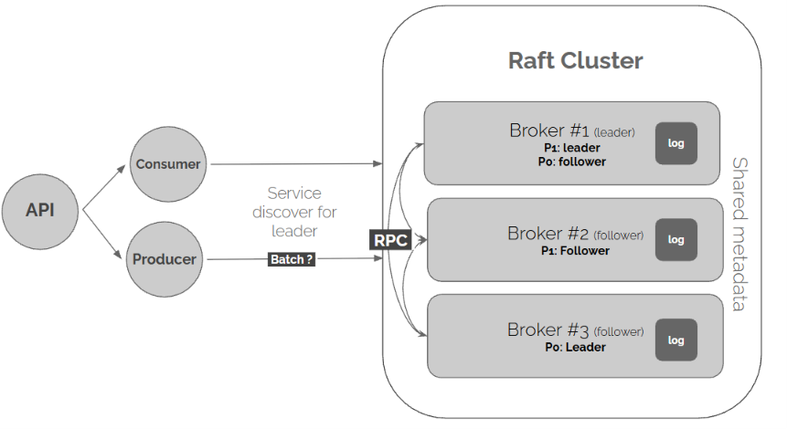
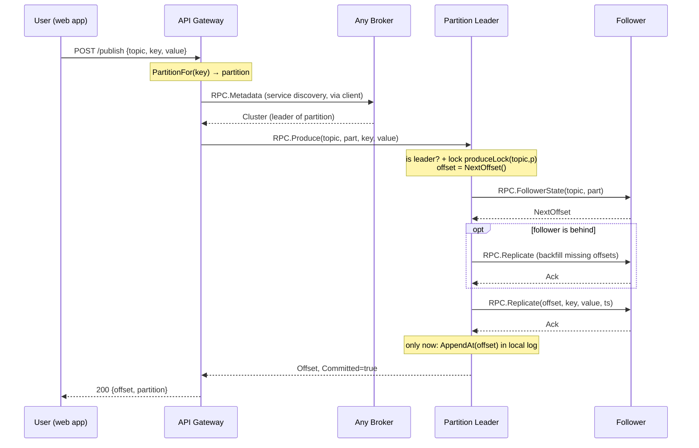
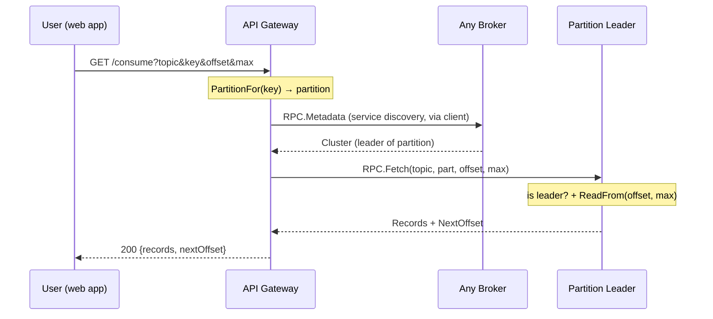
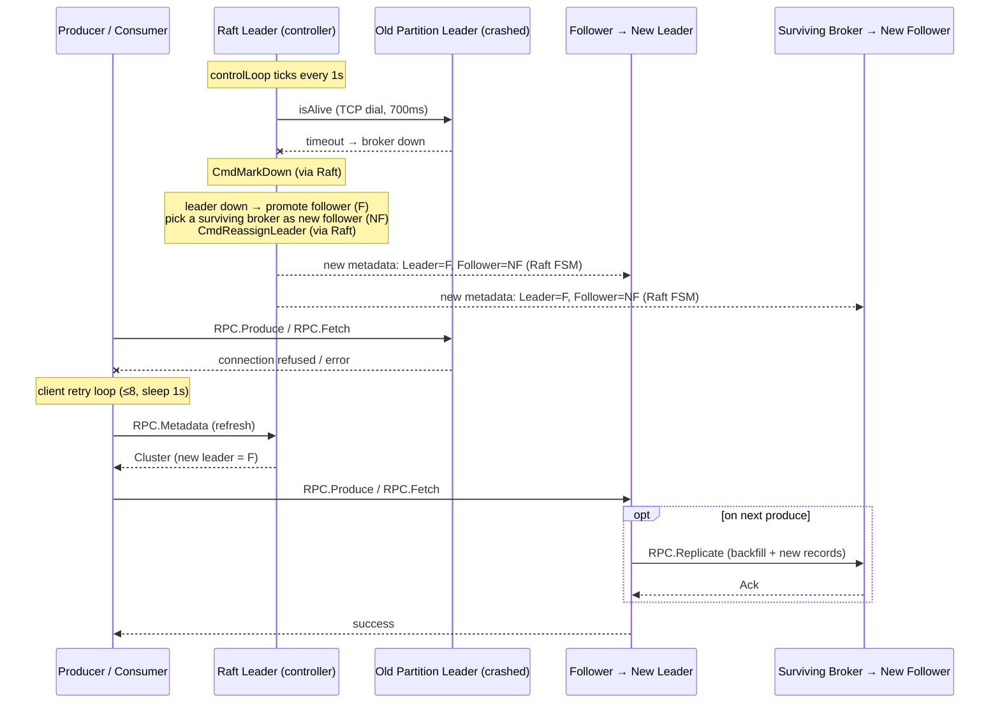

# Distributed Systems: TrixPS

**Author:** Théotime Flichy

---

## 1. Introduction

This project is called TrixPS. The aim is to design and implement a
high-performance, distributed Publish-Subscribe system. The architecture is ispired
of Apache Kafka.

## 2. Objectives

The main goals are to concretely understand and implement the following five
properties :

- **Partitioned Scalability :** distribute the load across nodes by splitting data into partitions.
- **Consensus Stability :** keep a single source of truth for the cluster metadata.
- **Fault Tolerance :** guarantee zero data loss after a node crash.
- **Automatic Failover :** keep the service available during a node failure.
- **Storage Persistence :** recover all data after a full restart.

## 3. System Architecture

### 3.1 Brokers

#### Role

A broker is one node of the pubsub architecture. It has to handle the control plane and the data plane.

#### Control plane

It manages the state of the cluster. The brokers use Raft to agree on one shared state. One broker is the Raft leader, the others are followers. If this is the leader, it sends heartbeats to the others to check who is alive, and it decides for each partition who is the leader and who is the follower. The new state is shared to everyone through Raft, so all the brokers stay consistent. We run 3 brokers, so a quorum of 2 keeps the cluster working even if one broker dies.

#### Data Plane

It stores the messages. For each partition, one broker is the leader and another is the follower. The leader handles the writes and the reads. The messages are saved in an append-only log on its own Docker volume. The follower keeps a copy of the data for redundancy. In this project we use 2 partitions, and each one is replicated on 2 brokers (1 leader + 1 follower).

#### Flow of a publish

1. The producer asks a broker who is the leader of the partition (Service Discovery).
2. It sends the message (or batch of messages) to the leader (RPC).
3. The leader picks the next offset for the message.
4. The leader sends the message to the follower and waits for its ack.
5. When the follower has acked, the leader writes the message in its own log.
6. The leader answers the producer with the offset.

#### Flow of a consume

1. The consumer asks a broker who is the leader of the partition (Service Discovery).
2. It sends a fetch request to the leader with its current offset (RPC).
3. The leader reads the messages from this offset in its log.
4. The leader answers with the messages and the next offset.
5. The consumer shows the messages and saves the next offset for later.

> Note: the CLI `producer` / `consumer` follow the same flow without the API layer — they call the client directly (`RPC.Metadata` then `RPC.Produce` / `RPC.Fetch`).

#### Flow of a failover

1. The Raft leader sends heartbeats to every broker.
2. A broker stops answering, so the leader marks it as down.
3. For each partition this broker was leading, the Raft leader picks a new leader (the follower if it is alive).
4. The new state is written to Raft and shared to all the brokers.
5. The producers and consumers ask again who is the leader and use the new one.
6. When a new message is produced, the follower catches up.

### 3.2 Producer

**Role :** To publish messages to the pub-sub app.

**Logic :** It performs *Service Discovery* to find the leader. Then it send the message.

### 3.3 Consumer

**Role :** Receive and show messages from the pub-sub service.

**Logic :** it subscribes to a topic and pulls messages directly from the partition
Leader. It keeps it's own offset to know which message has already been read.

### 3.4 API

**Role :** API to interact with pub-sub system with HTTP.

**Logic :** It exposes `/publish` and `/consume`.

### 3.5 Web example

**Role :** A small web app to demo the system. It is a Tic-Tac-Toe game played by two players.

**Logic :** It talks to the API to publish and consume. The matchmaking uses a shared `lobby` topic, and every move of a game is a message in the game topic.

## 4. Implementation Stack

- **Language:** Go (& Nextjs for example)
- **Deployment:** Docker

To implement raft, it use the **`hashicorp/raft`** library.
To interact between brokers, we use **RPC**.

## 5. Evaluation Metrics

#### Partitioned Scalability

**Goal :** distribute the load across nodes by splitting data into partitions.

A topic is cut into partitions. Each message goes to a partition based on its key, so different keys end up on different brokers.

#### Consensus Stability

**Goal :**  keep a single source of truth for the cluster metadata.

The brokers vote for one  leader. Only the leader changes the cluster info, and it shares it to the others, so everyone has the same view.

#### Fault Tolerance

**Goal :** guarantee zero data loss after a node crash.

Before ACK to the client, the leader copies the message to a follower and waits for its confirmation. So every message is on 2 brokers.

#### Automatic Failover

**Goal :** keep the service available during a node failure.

The brokers ping each other. If one stops answering, the leader gives its job to another broker that is still alive.

#### Storage Persistence

**Goal :** recover all data after a full restart.

Every message is written to a file on disk (a Docker volume), not only in memory.

## Thank you for reading
Have a good day !\
Théotime
